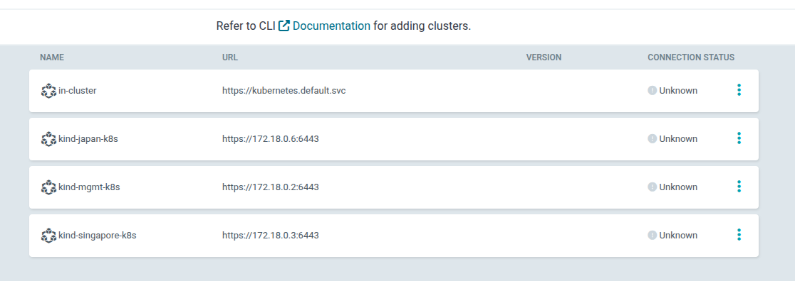
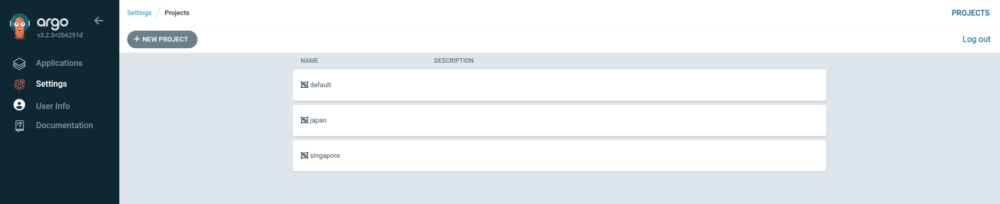
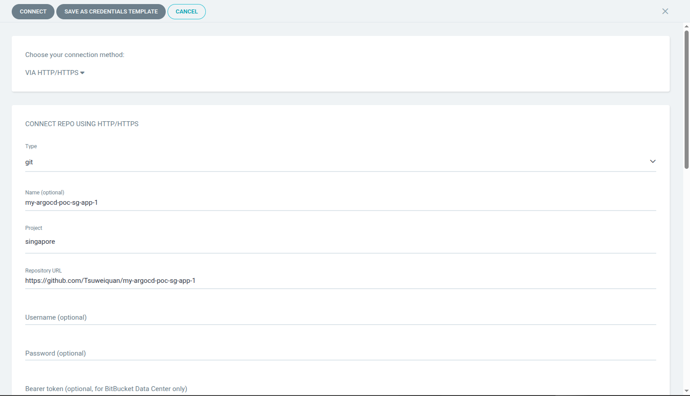
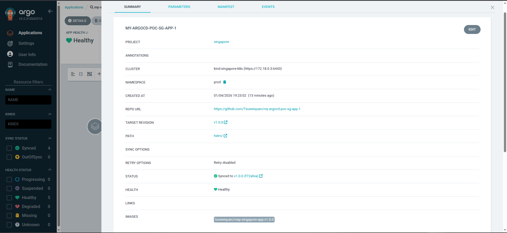

# ArgoCD Setup

## Argocd CLI
Since i expose my argocd to port 80 via cloud-provider-kind, i can use argocd cli to login

```bash
argocd login argocd.mgmt.local:80 --insecure --plaintext
Username: admin
Password: 
'admin:login' logged in successfully
Context 'argocd.mgmt.local:80' updated
```

## Add/Register kubernetes clusters

Adding of kubernetes cluster can only be done via the CLI
- https://argo-cd.readthedocs.io/en/stable/operator-manual/cluster-management/#adding-a-cluster

```bash
argocd cluster add kind-mgmt-k8s --insecure --plaintext --grpc-web
WARNING: This will create a service account `argocd-manager` on the cluster referenced by context `kind-mgmt-k8s` with full cluster level privileges. Do you want to continue [y/N]? y
{"level":"info","msg":"ServiceAccount \"argocd-manager\" already exists in namespace \"kube-system\"","time":"2026-01-04T17:02:17+08:00"}
{"level":"info","msg":"ClusterRole \"argocd-manager-role\" updated","time":"2026-01-04T17:02:17+08:00"}
{"level":"info","msg":"ClusterRoleBinding \"argocd-manager-role-binding\" updated","time":"2026-01-04T17:02:17+08:00"}
{"level":"info","msg":"Using existing bearer token secret \"argocd-manager-long-lived-token\" for ServiceAccount \"argocd-manager\"","time":"2026-01-04T17:02:17+08:00"}
Cluster 'https://172.18.0.2:6443' added
```
If you encounter this error during adding of clusters
```bash
{"level":"fatal","msg":"rpc error: code = Unknown desc = error getting server version: failed to get server version: Get \"https://127.0.0.1:44289/version?timeout=32s\": dial tcp 127.0.0.1:44289: connect: connection refused","time":"2026-01-04T16:57:59+08:00"}
```

Solution

```bash
kubectl get endpoints kubernetes -n default --context=kind-mgmt-k8s
NAME         ENDPOINTS         AGE
kubernetes   172.18.0.2:6443   43h

vim ~/.kube/config
Update the cluster to use the correct IP
# server: https://127.0.0.1:44289
server: https://172.18.0.2:6443
```

Add the clusters into argocd
```bash
argocd cluster add kind-mgmt-k8s --insecure --plaintext --grpc-web
argocd cluster add kind-japan-k8s --insecure --plaintext --grpc-web
argocd cluster add kind-singapore-k8s --insecure --plaintext --grpc-web
``` 


"Unknown" status is normal and expected for your management cluster after argocd cluster add succeeds. It shows "Unknown" because no Applications are deployed yet—ArgoCD only marks clusters "Successful" once they have monitored apps.
​

## Create a new Project for each region
Example: 
`argocd proj create myproject -d https://kubernetes.default.svc,mynamespace`

- Singapore
```bash
argocd proj create singapore \
  -d https://172.18.0.3:6443,prod \
  -d https://172.18.0.3:6443,uat \
  -d https://172.18.0.3:6443,dev \
  --grpc-web
```
- Japan
```bash 
argocd proj create japan \
  -d https://172.18.0.6:6443,prod \
  -d https://172.18.0.6:6443,uat \
  -d https://172.18.0.6:6443,dev \
  --grpc-web
```


### Grant permissions to deploy to the cluster
Under Project Summary Settings, we need to allow the following.
- We need to allow `cluster resource allow list` to the project namespace
- We need to allow `namespace resource allow list` to the project namespace

```bash
# Example:
# argocd proj allow-cluster-resource <PROJECT> <GROUP> <KIND>
# argocd proj allow-namespace-resource <PROJECT> <GROUP> <KIND> [<NAME>]
# argocd proj deny-cluster-resource <PROJECT> <GROUP> <KIND>
# argocd proj deny-namespace-resource <PROJECT> <GROUP> <KIND> [<NAME>]

argocd proj allow-cluster-resource singapore "*" "*" --grpc-web
> Group '*' and kind '*' is added to allowed cluster resources
argocd proj allow-namespace-resource singapore "*" "*" --grpc-web
> Group '*' and kind '*' not in denied namespaced resources

argocd proj allow-cluster-resource japan "*" "*" --grpc-web
> Group '*' and kind '*' is added to allowed cluster resources
argocd proj allow-namespace-resource japan "*" "*" --grpc-web
> Group '*' and kind '*' not in denied namespaced resources
```

## Add an Application
Adding application via UI the first time will be the easiest!

1. Add a new Repository
    - This should be the repository of your application
    - In this case, it will be my public repository on github
        - https://github.com/Tsuweiquan/my-argocd-poc-sg-app-1
    - Since this is a *public* repository, we can use HTTP/HTTPS without any credentials

```
argocd repo list --grpc-web
TYPE  NAME                    REPO                                                  INSECURE  OCI    LFS    CREDS  STATUS      MESSAGE  PROJECT
git   my-argocd-poc-sg-app-1  https://github.com/Tsuweiquan/my-argocd-poc-sg-app-1  false     false  false  false  Successful           singapore
```

2. Add a new application
General:
    - App Name: `<This will be the release name of the application>`
    - Project: `Select the argocd project created above` (e.g. singapore / japan)
    - Sync Policy: `Automatic / Manual` 
        - Checkbox
            - Auto Sync ✅
            - Prune ✅
            - SelfHeal ✅ 

Source:
    - Repository URL: `Select the repository created above`
    - Path: `helm/`
        - This is the path to the helm chart to deploy the application
    - TargetRevision: Tag -> `v1.0.0`

Destination:
    - Cluster: `Select the cluster` (e.g. kind-singapore-k8s / kind-japan-k8s)
    - Namespace: `Select the namespace` (e.g. prod)



```yaml
# Sample Argocd App Spec
project: singapore
source:
  repoURL: https://github.com/Tsuweiquan/my-argocd-poc-sg-app-1
  path: helm/
  targetRevision: v1.0.0
destination:
  namespace: prod
  name: kind-singapore-k8s
syncPolicy:
  automated:
    prune: true
    selfHeal: true
    enabled: true
```
